# TopBank Company - A Churn Prediction Project

---

## Table of Contents
- [Introduction](#introduction)
- [1. The Business Challenge](#1-the-business-challenge)
- [2. The Dataset](#2-the-dataset)
- [3. Feature Engineering](#3-feature-engineering)
- [4. EDA Summary and Insights](#4-eda-summary-and-insights)
- [5. Data Preparation and Feature Selection](#5-data-preparation-and-feature-selection)
- [6. Machine Learning Modelling and Fine Tuning](#6-machine-learning-modelling-and-fine-tuning)
- [7. Business Performance and Results](#7-business-performance-and-results)
- [8. Next Steps](#8-next-steps)
- [9. Lessons Learned](#9-lessons-learned)
- [10. Conclusion](#10-conclusion)
- [References](#references)

---

## Introduction

This repository contains the solution for this business problem (in portuguese): https://bit.ly/3ntCc6E

This project is part of the "Data Science Community" (Comunidade DS), a study environment to promote, learn, discuss and execute Data Science projects. For more information, please visit (in portuguese): https://sejaumdatascientist.com/

The goal of this Readme is to show the context of the problem, the steps taken to solve it, the main insights and the overall performance.

**Project Development Method**

The project was developed based on the CRISP-DS (Cross-Industry Standard Process - Data Science, a.k.a. CRISP-DM) project management method, with the following steps:

- Business Understanding
- Data Collection
- Data Cleaning
- Exploratory Data Analysis (EDA)
- Data Preparation
- Machine Learning Modelling and fine-tuning
- Model and Business performance evaluation / Results

---

## 1. The Business Challenge

**The TopBank Company**

- A Bank Services Company, with main operations on Europe.
- Offers financial products such as bank account, investments and insurance.
- Business Model: banking services through physical agencies and online.
- Main Product: bank account without costs, valid for 12 months. After this period, the account must be renovated.
- Bank account revenue per client:
    - 15% of client's estimated salary, for clients with estimated income lower than the average;
    - 20% of client's estimated salary, for clients with estimated income greater than the average.

**Problem**

- Clients' cancellation rate increased significantly in the last few months.

**Goal**

- Reduce clients' churn rate, that is, to avoid that the client cancel the contract and don't renovate it for more 12 months.

**Deliverables**

- Model's performance and results report with the following topics:
    - What's the company's current churn rate?
    - How the churn rate varies per month?
    - What's the model's performance to label the clients as churns?
    - What's the company's revenue, if the company avoids the customers to get into churn through the developed model?
- Possible measure: discount coupon or other financial incentive.
    - Which customers could receive an incentive and at what cost, in order to maximize the ROI (Return on investment)? - The sum of incentives shall not exceed $ 10,000.00.

[back to top](#table-of-contents)

---
    
## 2. The Dataset
### 2.1. Dataset Source
The Dataset is available on Kaggle: https://www.kaggle.com/mervetorkan/churndataset

### 2.2. Dataset Size and Dimensions
The dataset has 10,000 rows and 14 columns described below:

**RowNumber** - The number of the row.

**CustomerID** - Customer's unique identifier.

**Surname** - Customer's surname.

**CreditScore** - Customer's credit score for the consumer market.

**Geography** - The country where the customer lives.

**Gender** - Customer's gender.

**Age** - Customer's age.

**Tenure** - Number of years that the customer was active.

**Balance** - The amount that the customer has in the bank account.

**NumOfProducts** - The number of products bought by the customer.

**HasCrCard** - Flag that indicates if the customer has a credit card.

**IsActiveMember** - Flag that indicates if the customer has done a bank activity in the last 12 months.

**EstimateSalary** - Estimate customer's monthly income.

**Exited** - Flag that indicates if the customer is in Churn.

The dataset was split into train and test sets with a ratio of 80/20. The split was made in the beginning of the project, before any data manipulation / transformation.

### 2.3. Data Description
The dataset has three types of data: float64 (2), int64 (9) and object (3).
There are no missing values.

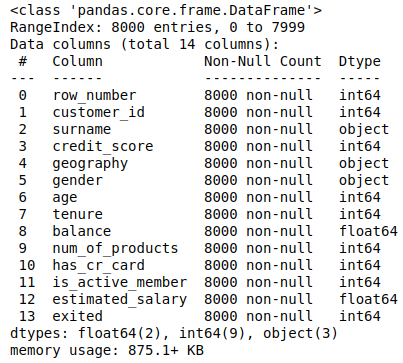

**Summary Statistics**

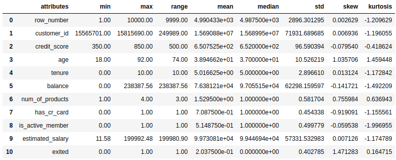

**Histogram**

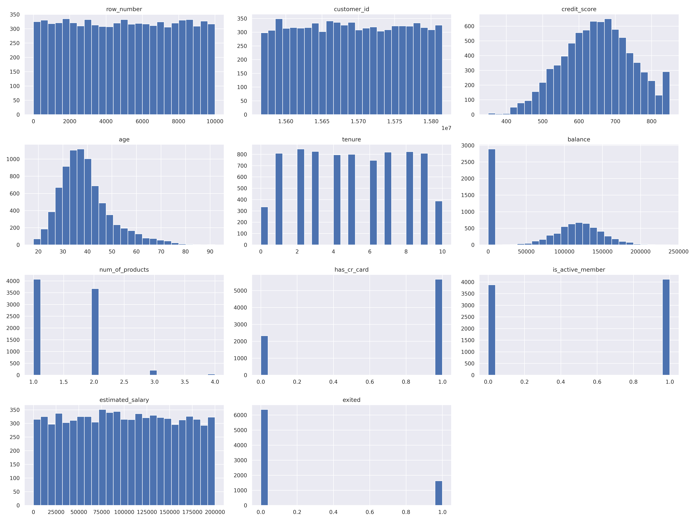

**Data Description Summary:**

**1. Credit Score**
- **Credit score ranges from 350 up to 850.** Mean = 650.75. Median = 652.
- There are 15 instances with credit score lower than 400. **All of them with 'exited' feature equal one (i.e., clients in churn).**

**2. Age**
- **Age ranges from 18 up to 92.** Mean = 38.95. Median = 37. 75% of the observations are up to the age 44.

**3. Tenure (number of years that the customer was active)**
- Tenure ranges from 0 to 10. Mean = 5.02. Median = 5. According the histogram, the number of customers with tenure equal to zero and 10 is lower than the other tenure values. 
- **4.19% of the customers were active for less than a year.**

**4. Balance**
- **Balance ranges from zero up to 238,387.** Mean = 76,381. Median = 97,055. 25% of the observations have value equal to zero.
- **2891 customers have balance equal to zero. That represents 36.14% of the customers.**

**5. Products**
- Number of products ranges from 1 to 4. Mean = 1.53. Median = 1. 75% of the observations have value equal to 2.
- The histogram shows that **the majority of number of products is 1 and 2. There is not any number of products equal to zero, that is, all customers have bought at least one product.**

**6. Credit Card**
- has_cr_card mean = 0.7087, that is, **70.87% of the customers have credit card.**

**7. Active Member**
- is_active_member mean = 0.5149, that is, **51.49% of the customers have done a bank activity in the past 12 months.**

**8. Estimated Salary**
- **Estimated salary ranges from 11.58 up to 199,992.** Mean = 99,730. Median = 99,446. The histogram shows that the distribution is similar to an uniform distribution.
- There are **43 instances with estimated salary lower than 1,000. Most of them have balance greater than 80,000, though.**

**9. Geography**
- **Almost 50% of the customers come from France.** 25% of the customers come from Germany and the other 25% come from Spain.

**10. Gender**
- **54.8% of the customers are men. 45.2% of the customers are women.**

**11. Surname**
- The most common surname is Smith with 26 times appearance.

**12. Churn Rate**
- **Clients in churn: 20.4%.**

[back to top](#table-of-contents)

---

## 3. Feature Engineering
### 3.1. Mind Map and Hypothesis List
The Mind Map shows the main factors that can contribute to a client to get into churn.
Both the mind map and the available data from the dataset will be the basis to create a hypothesis list.
The hypothesis list serves as the guide for the Exploratory Data Analysis (EDA), which aims to better understand the general data and features properties, as well as to generate business insights.

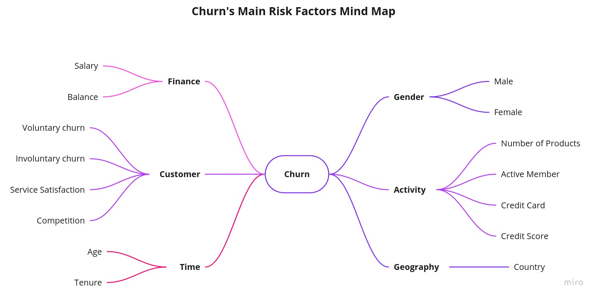

**Hypothesis List**

### 3.2. Feature Engineering
The Feature Engineering was executed mainly based on the features relationship, according to the analysis from the descriptive statistics.

12 new features were created and are described below:

- **tenure_year**: Client's year of the tenure. For example, a client that has just started with the bank has a tenure equal to zero and a tenure year equal one (first year with the bank).

- **age_ten_year**: age of the customer divided by the tenure_year.

- **credit_ten_year**: Ratio between credit score and tenure year.

- **cred_age**: credit score divided by the age of the customer.

- **amount**: sum of the client's estimated salary and balance.

- **amount_credit**: Ratio between the client's amount and credit score.

- **amount_ten_year**: client's amount divided by the tenure year.

- **amount_prod**: client's amount divided by the number of products.

- **cred_prod**: Ratio between client's credit score and the number of products.

- **bal_ten_year**: client's balance divided by the tenure year.

- **prod_m_cr**: number of producrs minus credit card.

- **prod_t_cr**: number of products times credit card.

[back to top](#table-of-contents)

---

## 4. EDA Summary and Insights
### 4.1. Univariate Analysis
The histogram below shows the distribution of the numerical features from original dataset and also the new features created in the feature engineering step.

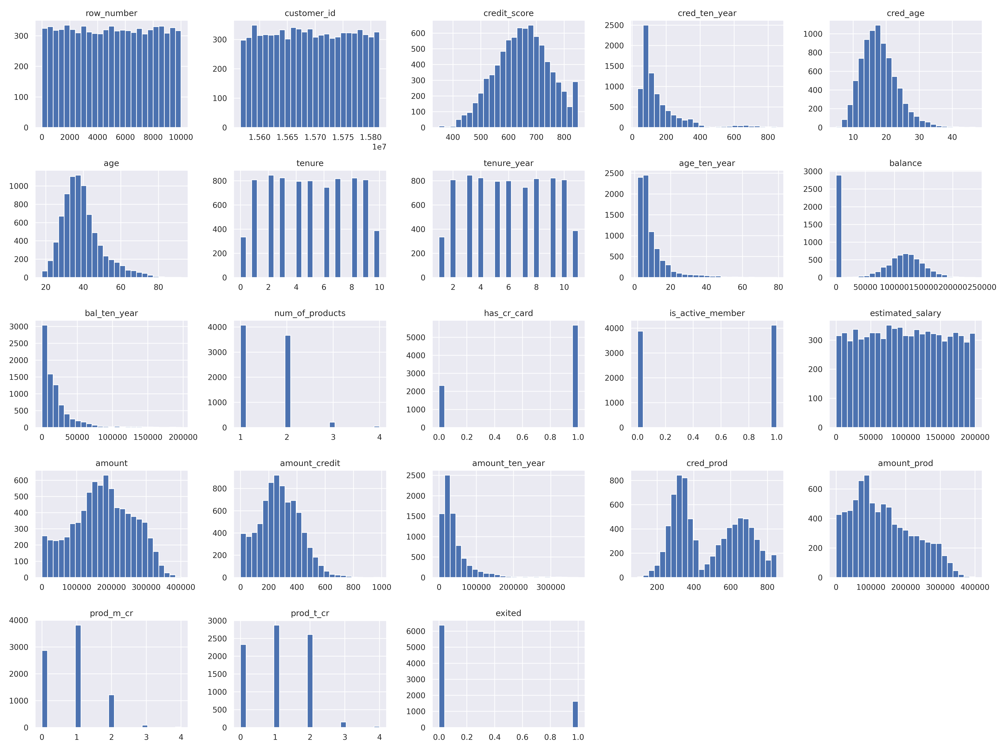

Highlights:

- **cred_ten_year** ranges from 31.8 to 850. Mean = 157.6. Median = 108.8. 75% of the observations have values up to 185.3. In average, the client gets 157.6 credit score for each year as bank's client. The value of 850 means that there are customers with the maximum credit score already in the first year as bank's client.

- **amount** ranges from 90 to 400,348. Mean = 176,112. Median = 176,913. 25% of the observations have values up to 117,544. 75% of the observations have values up to 240,249.

- **amount_credit** ranges from 0.14 to 984. Mean = 277. Median = 270. 25% of the observations have values up to 178. 75% of the observations have values up to 374. An amount_credit smaller than one means that the client has more credit score than money.

- **cred_prod** ranges from 94 to 850. Mean = 486. Median = 445. 25% of the observations have values up to 323. 75% of the observations have values up to 654. In average, the clients have 486 credit score per purchased product. The value of 850 means that there are clients with the maximum credit score which purchased only one product.

- **amount_prod** ranges from 45 to 400,348. Mean = 137,179. Median = 122,990. 25% of the observations have values up to 68,091. 75% of the observations have values up to 199,801. The value of 400,348 means that there are customers with the maximum amount which bought only one product.

### 4.2. Bivariate Analysis
Bivariate analysis highlights:

**H2. Churn should occur for clients with high balance - TRUE**

- 39% of clients not in churn have balance equal to zero. 24% of clients in churn have balance equal to zero.
- The balance density distribution shows that as the balance value increases, the relative proportion of clients in churn is greater than the proportion of clients not in churn.
- The Balance group's relative percentage barplot shows that from balance 90,000 on, the relative percentage of clients in churn is greater than the relative percentage of clients not in churn.
- The correlation heatmap shows a correlation coefficient of 0.12 between balance and exited feature.
- Therefore, the hypothesis is true: churn occur for clients with high balance.

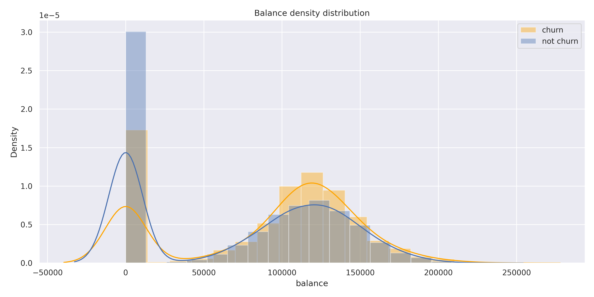

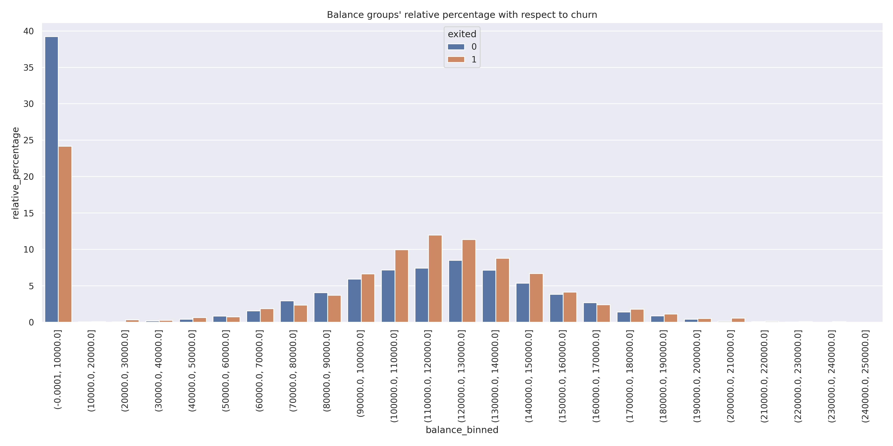

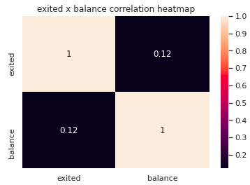

**H4. Churn should occur for clients with one product. - TRUE**

- Clients in churn: almost 70% have one product, 16.6% have two products, 10.4% have three products and 3% have four products.
- Clients not in churn: 53.4% have two products, 46% have one product, 0.6% have three products and none have four products.
- In absolute values, there are more clients in churn with three and four products than clients not in churn with three products. There are no clients not in churn with four products.
- Considering all clients with one product,  more than 70% are not in churn.
- Considering all clients with two products, more than 90% are not in churn.
- Considering all clients with three products, more than 80% are in churn.
- All clients that have four products are in churn.
- More than 50% of the clients have only one product.
- Therefore, the hypothesis is true: churn occur for clients with one product.

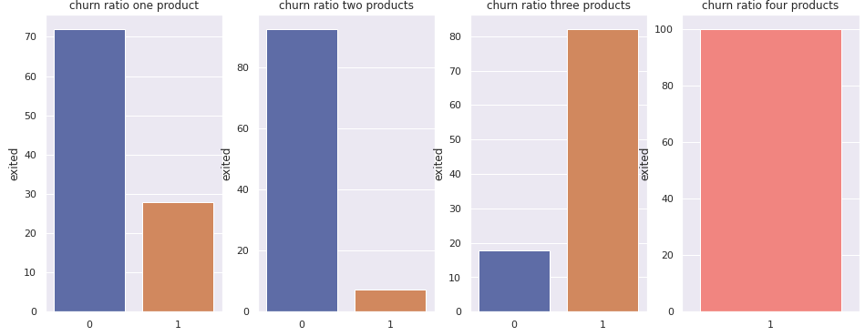

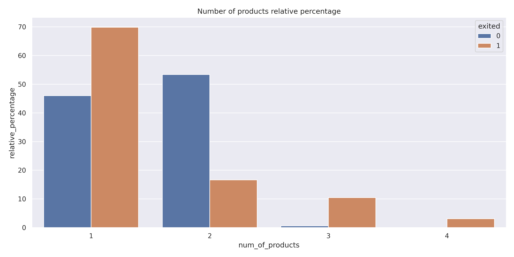

**H8. Churn rate should be higher for clients from Spain. - FALSE**

- 3993 clients (49.91%) are from France, 2005 clients (25.06%) are from Germany and 2002 clients (25.03%) are from Spain.
- Clients not in churn: 52.7% are from France, 26.2% are from Spain and 21.1% are from Germany. Compared to the whole dataset ratio, Germany decreased its proportion in aprox. 4%.
- Clients in churn: 40.7% are from Germany, 39% are from France and 20.3% are from Spain. Compared to the whole dataset ratio, - Germany increased its proportion in aprox. 15%. Conversely, Spain's ratio decreased in aprox. 5%.
- Therefore, the hypothesis is False: Churn rate is lower for clients from Spain.

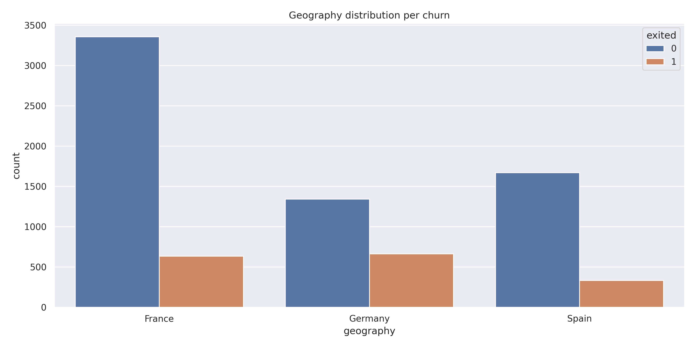

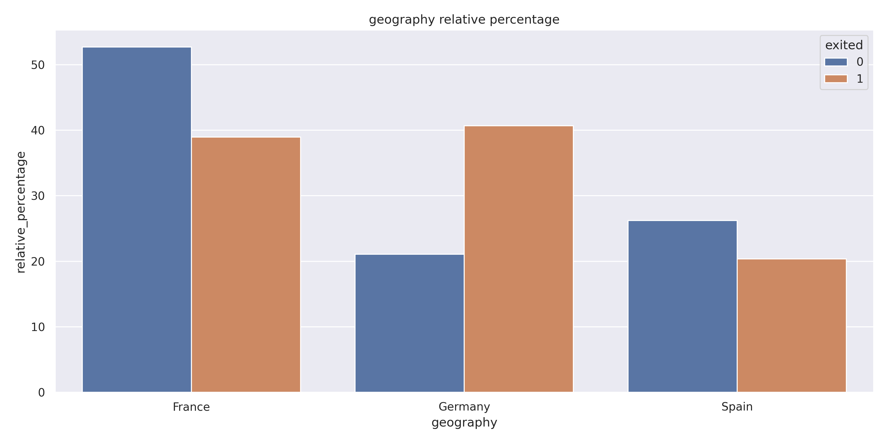

**H9. Churn rate should be higher among young clients - FALSE**

- The density distribution plot shows that churn is proportionaly greater from 40 year on.
- The relative percentage barplot shows that from 40 years until 65 years, the churn ration is greater than the not churn. For all other ages, the not churn proportion is greater.
- The correlation heatmap shows a correlation coefficient of 0.28.
- Therefore, the hypothesis is False: churn rate is lower among young clients.

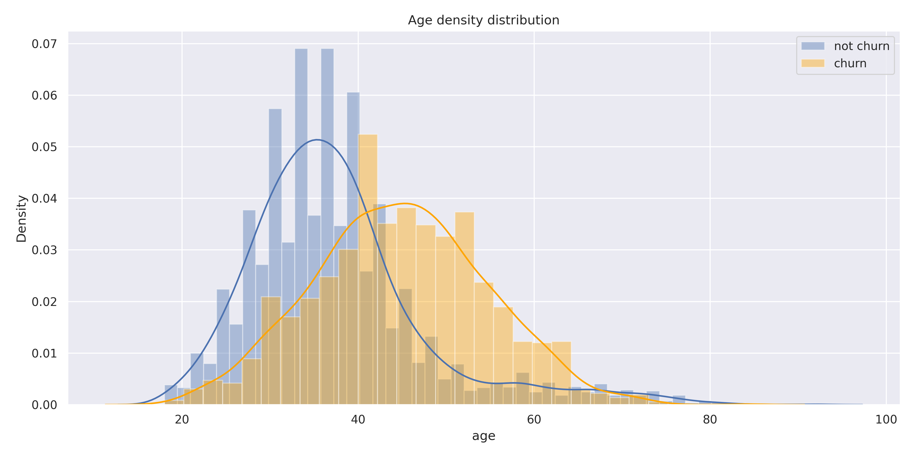

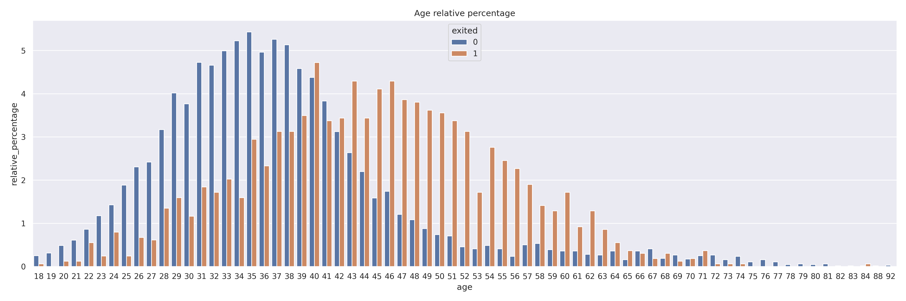

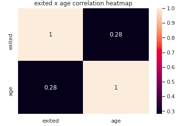

**Amount Feature Analysis**

- The amount density distribution plot shows that for the lowest amount values the majority of clients are not in churn. Conversely, for the highest amount values the majority of clients are in churn.
- The amount group's relative percentage plot shows that the amounts from zero to 120,000 have proportionaly more clients not in churn.
- From 120,000 to 190,000, the relative percentage of clients in churn and not in churn are miscelanious.
- From 190,000 on, the majority of relative percentages are from clients in churn.
- The correlation heatmap shows a correlation coefficient of 0.1 between amount and churn (exited).

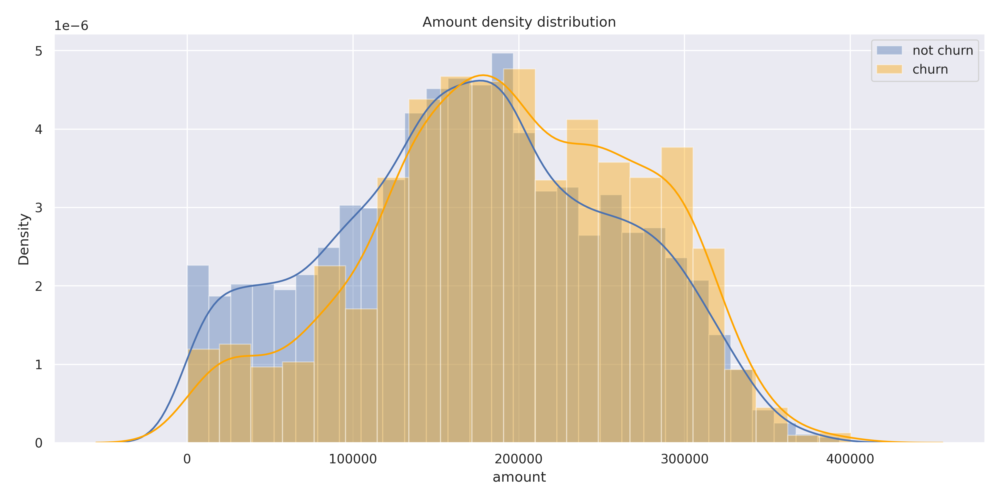

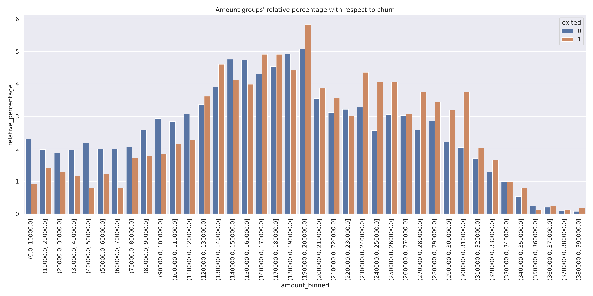

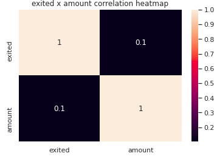

**Hypothesis Summary**

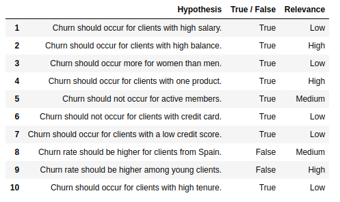

### 4.3. Multivariate Analysis
Multivariate analysis of numerical attribues made with pearson's correlation method.

Highlights:

amount_prod x balance = 0.69

balance x num_of_products = -0.31

cred_prod x balance = 0.32

amount x num_of_products = -0.21

amount x cred_prod = 0.22

cred_prod x bal_ten_year = 0.21

All the other highest correlations are among the new features and the original ones.

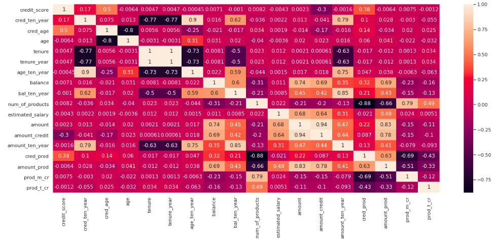

[back to top](#table-of-contents)

---

## 5. Data Preparation and Feature Selection
### 5.1. Rescaling
For data preparation, it is important to check outliers presence in order to determine the rescaler to be applied.
The boxplots below refer to some features in order to check outliers presence.

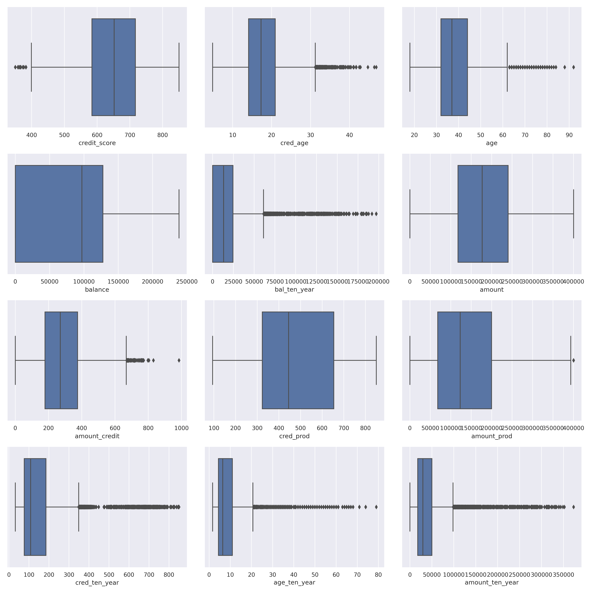

The rescaling methods applied below are based on the features distribution shape and boxplot outlier analysis.

- Standard Scaler: applied on variables with a distribution shape similar to a normal distribution.
        - Features: credit_score
- Min-Max Scaler: applied on variables with low outliers influence.
        - Features: cred_age, age, tenure, tenure_year, balance, estimated_salary, amount, cred_prod, amount_prod, prod_m_cr, prod_t_cr
- Robust Scaler: applied on variables with high outliers influence.
        - Features: amount_cred, cred_ten_year, age_ten_year, bal_ten_year, amount_ten_year

### 5.2. Transformations
The One-Hot Encoding was applied to both geography and gender features due to their low cardinality.

### 5.3. Feature Selection
The first step of feature selection was to remove unnecessary features for the machine learning training: row_number, customer_id and surname.

In the second step, the "exited" feature was detached from the train dataset to become the target variable, in order to allow the model to be trained.

The third step was to apply a random forest classifier to determine the most relevant features:

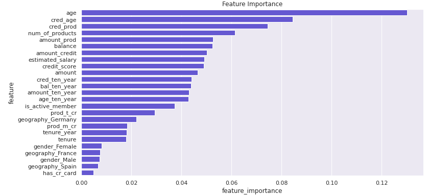

The top 13 features were selected, as well as geography and is_active_member features (based on EDA), to train the model.

[back to top](#table-of-contents)

---

## 6. Machine Learning Modelling and Fine Tuning
### 6.1. Data Balance
As the target variable (exited = 1) represents 20% of the total dataset, the SMOTETomek technique was applied in order to balance the train set. This technique is basically an oversampling with synthetic data generation (SMOTE (Synthetic Minority Oversmapling Technique)) + an undersampling (TOMEK Links).
After the resampling, the target variable ratio changed to 50 / 50:

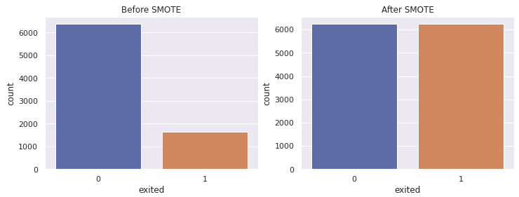

### 6.2. Models and Performance
The following classifiers were trained in order to solve the churn prediction task.
- Logistic Regression;
- Random Forest;
- XGBoost.

Two trains were performed: first with original imbalanced data, then with balanced data.
All the models were evaluated through 10-fold cross-validation on the train dataset.
The results are displayed below:

**Models trained with Imbalanced Data**

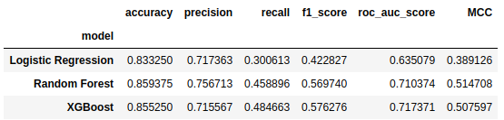

The Random Forest Classifier has the best precision (0.75) and MCC (0.51).
The XGBoost classifier has the best recall (0.48), F1-Score (0.57) and roc-auc-score (0.717).

**Models trained with Balanced Data**

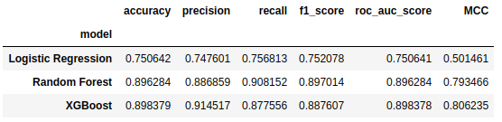

The models' overall performance improved significantly when trained with balanced data.
The Random Forest Classifier has the best recall (0.90) and F1-Score (0.89).
The XGBoost Classifier has the best precision (0.91), roc-auc-score (0.898) and MCC (0.80).

Based on the Business context and in order to better accomplish the project goals, deliverables and deployment, the chosen model to perform the fine tuning is Random Forest.

### 6.3. Fine Tuning
The Fine Tuning was performed using the Random Forest Classifier. Two fine-tuning were performed: the first with balanced data, and the second with imbalanced data.

A Randomized Search was executed through sklearn's `RandomizedSearchCV` function to perform the fine tuning.

The metrics were calculated using the **test set**, so that the models can be evaluated on unseen data, therefore a more realistic scenario.

The Random Forest with default hyperparameters, as well as the XGBoost, were also evaluated with their predictions on the test set for comparison purpose. The results are showed below:

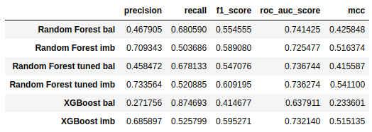

The model with best performance, that is, with best F1-Score and best MCC is Random Forest tuned imb (Random Forest trained on original imbalanced data and fine-tuned).

What draws attention is the fact that the models trained with balanced data had a significant performance decrease on the test set compared to the metrics obtained with the train set, that is, the models overfitted the train data and could not generalize well on the test data, which means that it will have a poor performance on new data.

## 7. Business Performance and Results
### 7.1. Model Performance
The graph below shows the model's precision and Recall curves versus the decision threshold.
The decision threshold is the cut-off value that the classifier considers to classify an instance as exited = 1 (probability > threshold) or exited = 0 (probability < threshold), based on the model's probability prediction of each instance to get exited or not.

The default threshold is 0.5. If the threshold is set to be greater than 0.5, than the precision will increase, however the recall will decrease. Conversely, if the threshold is set to be lower than 0.5, than the recall will increase, however the precision will decrease.

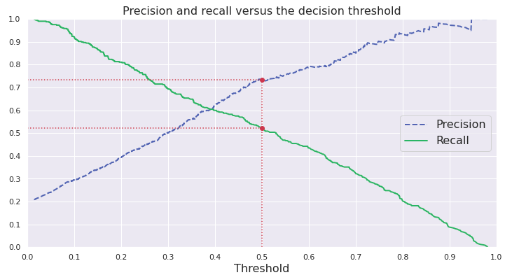

In this project, increasing the threshold means that the model will improve the ratio of correctly predicted clients in churn, however it will detect less clients prone to churn.
Conversely, decreasing the threshold means that the model will detect more potential churn clients, however the ratio of correctly predicted clients in churn will decrease.

The precision versus recall curve shows that the greater the precision, the lower the recall, and vice-versa.

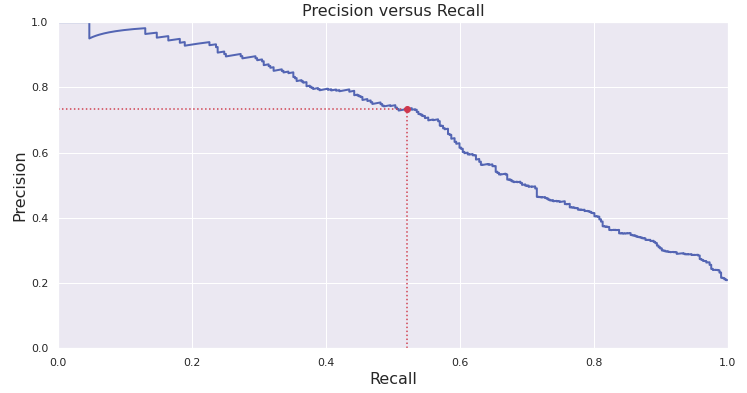

The Receiver Operating Characteristic Curve (ROC Curve) below shows that even though the False Positive Rate value or the True Positive Rate value of the model is set differently from the default values, the overall performance of the model remains the same, because the area under the curve remains the same.
To improve the overall performance, the model must be fine tuned again or another model must be trained, so that the ROC area under the curve increases (the line must get closer to the top left corner).

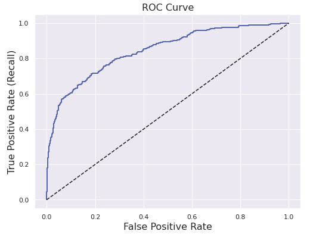

The trained model can predict if the customers will get into churn or not according to the metrics and performance presented above.
However, the model is not capable to determine which customers should receive an incentive in order not to leave the bank.
Hence, another two metrics must be applied in order to prioritize and determine the clients that should receive a financial incentive: the Lift Curve and Cumulative Gains Curve.

### 7.2. Lift Curve and Cumulative Gains Curve
Lift is a measure of the effectiveness of a model calculated as the ratio between the results obtained with and without the predictive model.
The lift curve uses the returned probability of a classification model to assess how the model is performing, and how well it is identifying the positive or negative instances of the dataset.

To generate both Lift and Cumulative Gains Curve, **the dataset must be sorted with respect to the predicted probabilitity of belonging to the target class output by the model, along with the actual class that the record belongs to from the test set.** All of the observations need to be **ordered according to the output of the model in descending order.**

By ordering the data from the highest to the smallest probability, **the highest probability appear on the left of the graph**, usually along with the highest Lift scores.

The lift chart provides an easy way to visualize how many times better applying the model is than random selection for any percentage of the ranked records.
The greater the area between the lift curve and the baseline, the better the model.

Both Lift and cumulative Gains curves were generated with the scikitplot library.

**Lift Curve**

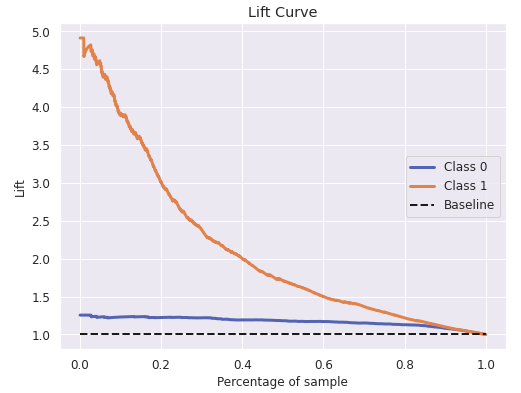

The x axis shows what percentage of the observations are being considered. In this case, it is a percentage of the 2,000 clients from the test set. Note that the dataset is ordered from the highest to the smallest probability, therefore the left hand side of the x-axis start with the observations that have the highest probability of belonging to the class of interest.
The y axis shows the ratio between the results predicted by the model and the result using no model.
The Lift curve shows that if 20% of the customers are contacted, using the prediction of the model should reach 60% of customers in churn. The y-value of the lift curve at 20% is 60 / 20 = 3, that is, with the model it is possible to reach 3x more churn customers than random client selection.

**Cumulative Gains Curve**

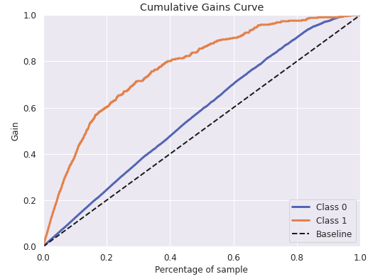

As in the Lift Curve, the x axis shows what percentage of the observations are being considered. In this case, it is a percentage of the 2,000 clients from the test set.
The y axis (Gain) indicates the percentage of positive responses. In this case, it is the percentage of the 407 positive responses from the test set.
The cumulative gains curve shows that if 20% of customers with highest probability to churn are contacted, using the prediction of the model should reach 60% of total customers in churn. As a comparison, using the baseline model, that is, using a random client selection, should reach only 20% of clients in churn. This means that using the model is 60% / 20% = 3 times better than random selection, which is exactly the value showed on the lift curve.

This works the reverse way as well: if the business goal was, for example, to reach 80% of the customers that are most likely to respond, than this amount can be located on the y-axis and determine that roughly 40% of the customers would need to be used to achieve that.

### 7.3. General Business Results
All the business results were calculated on the test set.

As stated in the business challenge:
Bank account return per client:
- 15% for clients with estimated income lower than the average;
- 20% for clients with estimated income greater than the average.

**Revenue:**

- The total current return of all clients is 38,079,850.98.
- Total revenue loss if all 407 clients in churn leave the bank: 7,491,850.97.
- The total revenue loss represents 19.67% of total current return.

**Company's revenue , if the company avoids the customers to get into churn through the developed model:**

- Company's recovered revenue if 212 clients don't get into churn through the model: 4,064,569.35.
- That represents 52.09% of clients labeled as in churn and 54.25% of the total revenue loss.

This is an ideal scenario if the bank could give a gift or a financial incentive for all predicted clients in churn.
However, as stated in the business challenge, the amount available to give a financial incentive for the clients is constrained to 10,000, that is, is a limited resource that must be applied so that the return on investment (ROI) is maximized.
Furthermore, even if a client receives an incentive, it does not necessarily mean that this client will not leave the bank, hence a more realistic scenario must be built in order to deal with such situation.
The next step will show alternatives to deal with it.

### 7.4. Customer Incentive to Maximize ROI
The Lift Curve and Cumulative Gains Curve showed that if the clients with the highest churn probability according the model's prediction are selected, then the gain over a random selection is maximized.
In this context, two scenarios were simulated: one with the top 100 clients with highest churn probability and the other with the top 200 clients.

The top 100 clients selection considered a financial incentive of $100 for each client, so that the available budget of $10,000 is not exceeded.
The revenue result was calculated as the following:
- Clients predicted as in churn and actually in churn (exited = 1): recovered revenue equal to the return that this clients gives to the bank.
- Clients predicted as in churn but actually not in churn (exited = 0): recovered revenue equal to zero, because the client would not leave the bank anyway (the incentive should be given to another client).
The profit is the difference between recovered revenue and the incentive per client. Hence, clients with exited = 0 will generate a negative profit (investment loss).

**Top 100 Clients Results**
- Recovered Revenue: 1,672,172.96
- % Recovered from Total Revenue loss: 22.32%
- Investment: 10,000.00
- Profit: 1,662,172.96
- ROI: 16,621.73%
- Potential clients recovered acc. model: 93
- Potential churn reduction: 22.85%

Similarly, the top 200 clients selection considered a financial incentive of $50 per client, in order to not exceed the investment budget of $10,000.

**Top 200 Clients Results**
- Recovered Revenue: 3,089,126.96
- % Recovered from Total Revenue loss: 41.23%
- Investment: 10,000.00
- Profit: 3,079,126.96
- ROI: 30,791.27%
- Potential clients recovered acc. model: 159
- Potential churn reduction: 39.07%

The top 200 clients results are significantly better because it considers more clients than the previous scenario.

Nevertheless, the above-mentioned scenarios don't optimize the total revenue for the company. For example, if the top 100 clients are selected to receive a financial incentive, the return, say, of the 99th client can be much lower than the return of the 101th client that, in this case, would not be selected.

Considering the available budget of $10,000, and considering that to optimize the revenue it is necessary to select the clients with the highest return for the bank, and that these clients will receive an incentive to stay in the bank, what can be done to select such clients?
The approach to solve this problem is to use the "0-1 Knapsack Problem". Here's why:
- Goal: select the optimal combination of clients that maximize the total returned value , without exceeding the total weight constraint.
- In this case, each client has a "weight": the financial incentive that will be given in order to avoid the churn.
- The total weight constraint is the total amount available to give the incentives: $ 10,000.00.
- The incentive can either be offered or not: 0-1 (0-1 Knapsack).

A Knapsack function was created in the code to apply the 0-1 knapsack to the TopBank problem.
An incentive of $100 was considered in this first scenario.

**"0-1 Knapsack-Problem" approach Results**
- Recovered Revenue: 2,655,711.90
- % Recovered from Total Revenue loss: 35.45%
- Investment: 10,000.00
- Profit: 2,645,711.90
- ROI: 26,457.12%
- Potential clients recovered acc. model: 78
- Potential churn reduction: 19.16%

The result is much better compared to the top 100 clients scenario that gave also $100 incentive per client.

However, what if not all of these customers stay in the bank, even receiving an incentive? Also, could the incentive value be different, for example, for clients with a lower churn probability?
To answer this questions, a more realistic scenario was drawn considering these realistics aspects. The following premises were adopted:
- Some customers will leave no matter what: p(churn) > 0.99
- Some might stay but only with a $200 incentive: 0.95 < p(churn) < 0.99
- Some will stay with a $100 incentive: 0.90 < p(churn) < 0.95
- Others will stay with a $50 incentive: p(churn) < 0.90

Again, the knapsack approach was applied to select the clients that will provide the maximized revenue, considering the above-mentioned scenario.

**The Realistic Scenario with "0-1 Knapsack-Problem" approach Results**

- Recovered Revenue: 3,381,860.54
- % Recovered from Total Revenue loss: 45.14%
- Investment: 10,000.00
- Profit: 3,371,860.54
- ROI: 33,718.61%
- Potential clients recovered acc. model: 131
- Potential churn reduction: 32.19%

The realistic scenario obtained the best results compared to the previous scenarios.
It generates a profit of 3,371,860.54, 9.5% greater than the second best scenario profit of 3,079,126.96 (top 200 clients).
One interesting fact is that the potential clients recovered in the realistic scenario (131) is lower than the recovered clients of the top 200 scenario (159). Even so, the revenue of the realistic scenario is greater than the top 200. That shows that selecting the right clients brings the maximized revenue to the company instead of selecting the greatest number of clients.

That's beacuse the clients selection to deliver the maximized revenue is optimized.
Furthermore, three financial incentives were granted according to the churn probability. Specially the incentive of $50 for clients with churn probability lower than 0.90 probably considered a relevant number of clients. This is important because, for example, one client that receives a $100 incentive has the same investment of two clients that receive $50 each.

### 7.5. Business Performance Summary
Business final results and answers to the business challenge questions.

**Business Questions**
- What's the company's current churn rate?
- How the churn rate varies per month?
- What's the model's performance to label the clients as churns?
- What's the company's revenue, if the company avoids the customers to get into churn through the developed model?
- Possible measure: discount coupon or other financial incentive. Which customers could receive an incentive and at what cost, in order to maximize the ROI (Return on investment)? (the sum of incentives shall not exceed $ 10,000.00).
    
**Business Results**
- The company's **current churn rate is 20%.**
- It is not possible to determine the churn variation per month, as the available data does not have information per month. What can be calculated is the churn variation per tenure (number of years that the customer was active). Note: this churn variation considers only the proportion of churn in the tenure itself.

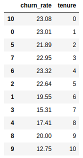

- The model has a precision of 73.4% to label the clients as churns. The model can detect 52.1% of clients in churn.
- Total current revenue considering all clients: **38,079,850.98.**
- Total revenue loss if all 407 clients in churn leave the bank: **7,491,850.97 (19.67% of current total revenue).**

**Ideal Scenario according the model:**
- Company's revenue if 212 clients don't get into churn through the model: **4,064,569.35.**
- That represents **52.09% of clients** labeled as in churn and **54.25% of the total revenue loss.**

**Discount coupon or other financial incentive - Optimal Solution**

**Realistic Scenario (Alternative 4)**

Incentive value per client according model's predicted churn probability-range and maximum returned value with "0-1 Knapsack-Problem" approach.

- Recovered Revenue: 3,381,860.54
- **% Recovered from Total Revenue loss: 45.14%**
- Investment: 10,000.00
- **Profit: 3,371,860.54**
- ROI: 33,718.61%
- Potential clients recovered acc. model: 131
- **Potential churn reduction: 32.19%**

[back to top](#table-of-contents)

---

## 8. Next Steps
The next steps of the project are listed below in priority order.
The goal of the next steps is to improve the model performance, hence to improve the business revenue / results.

- Better evaluate and experiment feature application in the current model in order to improve its results.
- Train another model in order to improve the overall performance: F1-Score, MCC, Precision and Recall.
- Data Balance experiment and evaluation.

[back to top](#table-of-contents)

---

## 9. Lessons Learned
### 9.1. What went wrong?
- Feature Engineering might be improved

The main goal of the feature engineering is to create features that better represent the phenomenon to be modelled, and therefore aid the model to learn and make improved predictions. In this project, as the original features were tightly mixed with respect to both labels of the target class, the feature engineering did not help to improve considerably the model performance, and/or did not find a pattern to distinguish positive and negative labels of the target variable.
Some features were created in order to find a pattern in the data to help the model to learn about the phenomenon, however the new features basically kept the same patterns from the original dataset features, which did not help the model to improve significantly its performance.
Actually, some of the new features created had more importance to the model than some original features, as checked in the feature selection step, therefore the new features helped somehow the model to have a better peformance that it would have only with the original features. The point here is that the feature engineering can be improved (in the next CRISP cycle for example) so that the model performance can also be improved significantly.

- Training on Balanced Data did not achieve the expected results

The model trained on balanced data did not achieve the expected results on the test set.
The dataset is imbalanced with respect to the target class: it has a ratio of 80/20. The dataset was balanced with the SMOTETomek technique in order to improve the model's performance. However, as the models trained on the balanced data improved significantly the metrics on the train set compared to the models trained on the original imbalanced data, they had poor performances when applied to the test set - it was expected a similar performance of the train set, which represents an overfitting. The reason for this behavour must be analysed in deeper detail, and is therefore one of the measures of the next steps.

- The "ordinary" model-assessment metrics did not help answering the business questions.

The model-assessment metrics such as F1-Score, Precision and ROC-AUC helped to compare the trained models and therefore to choose the better one to carry out the project predictions. Nevertheless, as the final Business Performance Step was achieved, it was realized that these model performance metrics could not answer the main business question of this project: "Which customers could receive an incentive and at what cost, in order to maximize the ROI (Return on investment)?". This is particularly specific of projects such churn prediction or marketing campaigns (that involves clients to be contacted), therefore additional metrics are needed to answer the business question.

### 9.2. What went right?
- Density plots showed that the features with high variability are the most relevants for the model.

The density plots were plotted with respect to the positive and negative labels of the target class. As they are normalized distributions, it is possible to check and compare the feature behavour for both labels. When both distributions are tightly overlapped, then it is harder for the model to distinguish the positive and negative labels with respect to that feature. However, when the distributions are detached, that is, when it is clear that the positive and negative labels distribution are not overlapped, then it is easier to distinguish both of them. What could be checked in this project is that even the slightest detachment of the target labels distribution of a feature determined it as an important feature for the model, as latter checked in the feature selection step (random forest's feature importance was used for that). Hence, the more variability of a feature with respect to the target class labels, the better for the model to model the phenomenon.

- Additional metrics to evaluate model performance according to the business challenge: lift curve and cumulative gains curve.

The metrics that helped to answer the main business question was the Lift curve and the cumulative gains curve, as they sort the predicted probability of each instance to belong to a label of the target class, and therefore can be used to prioritize the clients to be contacted. Also, they can be applied to compare the trained models, hence these are the specific metrics that can both compare models and answer the business question. The usage of such metrics depends on the business problem that the project is being designed for: for instance, if a project aims only to classify labels regardless of the prioritization, then these metrics are not mandatory to be used. However, if it involves prioritization such as clients to be contacted in a marketing campaign or to avoid churn, then these are the right metrics for both model performance evaluation and for answering the business question (which customers should be contacted?).

- Optimized solution to solve the business challenge: knapsack problem approach.

The knapsack problem approach was the perfect technique to optimize the results of the business challenge. That's because it has the following elements that fit in the business challenge proposal:
    - Each element has a value. Business problem: each client provides a revenue for the bank;
    - Each element has a weight. Business problem: each client will receive a financial incentive not to leave the bank;
    - There is a constrained total weight. Business problem: the total amount for the financial incentive is $ 10,000.

With this reciprocal analysis it was possbile to apply the 0-1 knapsack problem approach to optimize the solution of the business problem. It is an exact optimal solution and an specific optimized algorithm. Hence, depending on the problem, the machine learning algorithms cannot provide the right answer for a specific business problem, and it is necessary to search outside the ML to find another technique to solve the problem.

### 9.3. What can be learned from this project?
- The new features created on the feature engineering might not help to characterize the phenomenon.

- The model trained on balanced data might fail on the test set.

- The "ordinary" model-assessment metrics might not answer the business questions.

- Density plots are a good way to check the target class variability and to evaluate the relevant features for the model.

- The Lift Curve and Cumulative Gains Curve are metrics to compare models' performance and can be used to prioritize clients to be contacted.

- The Knapsack-problem approach can be applied to solve and optimize a business problem.

[back to top](#table-of-contents)

---

## 10. Conclusion
This project was developed in order to meet the TopBank's business challenge of churn prediction and to determine which clients should be contacted in order not to leave the bank and hence reduce the churn ratio.
The solution was built with a combination of machine learning algorithms that modelled the phenomenon and predicted the churn, as well as with an optimization algorithm based on the 0-1 Knapsack Problem to select the clients to receive a financial incentive not to leave the bank that maximizes the revenue for the bank.

The project delivers a model that has a precision of 73.4% and can detect 52.1% of clients in churn, recovers 45.14% of total revenue loss, enables a profit of $ 3,371,860.54 and gives a potential churn reduction of 32.19%.

The main challenges of the project were: 
- The data with low variability with respect to positive and negative labels of the target variable: hard to find a pattern to distinguish them.
- The metrics used to evaluate the model can help calculating the business performance but cannot answer all the business questions, hence cannot meet all business results needs.
- Optimized solution to the business challenge outside the "Machine Learning Box".

Finally, the key point to improve the churn prediction and increase the revenue is in the model's performance: enhance the current model performance with new features / feature selection, experiment another models in order to achieve better performance, better evaluate the usage of balanced data to train the model. As the model improves its precision and recall, more clients can correctly be labeled as in churn and hence be contacted in order not to leave the bank, reduce the churn ratio and improve TopBank revenue.

[back to top](#table-of-contents)

---

## References
**Churn**

https://en.wikipedia.org/wiki/Customer_attrition

**Lift and Cumulative Gains Curve**

http://www2.cs.uregina.ca/~dbd/cs831/notes/lift_chart/lift_chart.html

https://www.kdnuggets.com/2016/03/lift-analysis-data-scientist-secret-weapon.html

https://towardsdatascience.com/the-lift-curve-unveiled-998851147871

https://towardsdatascience.com/evaluate-model-performance-with-cumulative-gains-and-lift-curves-1f3f8f79da01

**0-1 Knapsack Problem**

https://en.wikipedia.org/wiki/Knapsack_problem

https://www.youtube.com/watch?v=QOaxir6Qek4

https://www.geeksforgeeks.org/python-program-for-dynamic-programming-set-10-0-1-knapsack-problem/

[back to top](#table-of-contents)

---